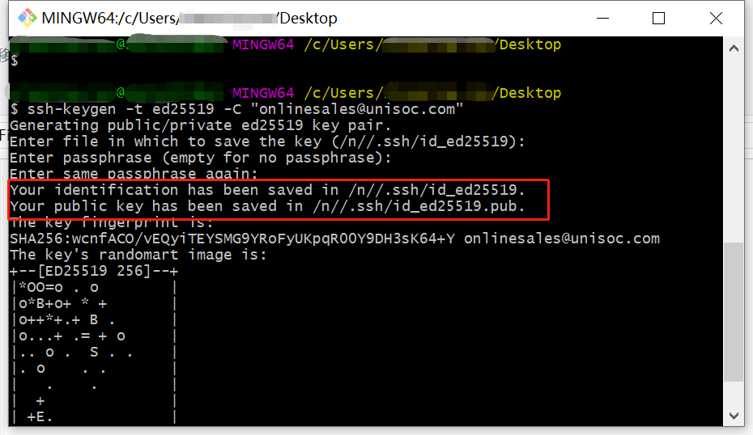
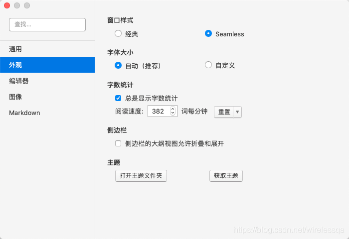

为了写出统一标准的文档，请大家在贡献文档内容时，统一按照本文介绍准备环境。

## 账号准备

参与撰写文档需要一个 GitHub 帐户，如果还没有帐户，请自行创建。 [注册GitHub账户](https://github.com/join)

## 工具安装

- [Git](https://git-scm.com/download)
  > [!tip]
  > 版本管理工具，可以方便维护文档版本。

- [Python](https://www.python.org/downloads/)（本地预览，可选）
  > [!tip]
  > 基础工具软件，可以快速执行一些脚本。

- [Typora](https://typora.io/)（可选）
  > [!tip]
  > Markdown编辑器，所见即所得，适合无编程经验的用户使用。

- [Visual Studio Code](https://code.visualstudio.com/Download)（可选）
  > [!tip]
  > Markdown编辑器，插件比较丰富，适合有一定编程基础用户使用

> [!warning]
> 上述四个工具各有用处，建议所有文档维护人员都安装。后续的编写和发布环节这四个工具均会用到。UNISOC内部同事可直接在`软件中心`安装上述软件。建议Python安装3.XX版本。

## 工具配置

所有工具均需要在安装后按照下文所述配置一次，后续直接使用即可。

下边您的GitHub 账号

### Git 配置

下边以 GitHub 账号teckbond(onlinesales@unisoc.com) 为例，介绍Git 配置流程，主要分为以下几个步骤：

#### 账户配置

首先需要把 GitHub 账号配置起来。桌面空白处点击鼠标右键，选择 "Git Bash Here" 菜单，启动Git命令行。

- 用户名配置：Git命令行输入如下命令配置用户名(teckbond替换为你的github账户用户名)：

  ```Bash
  git config --global user.name "teckbond"
  ```

- 邮箱配置：Git命令行输入如下命令配置用户名(onlinesales@unisoc.com替换为你的github账户邮箱)：

  ```Bash
  git config --global user.email "onlinesales@unisoc.com"
  ```

Git命令行输入如下命令检查上述配置是否生效：

```Bash
git config --list
```

下图红框处即为配置成功的截图。


#### 密钥生成

上边账户配置完成后，就可以开始生成密钥了。还是在Git 命令行中执行（onlinesales@unisoc.com替换为你的github账户邮箱）：

```Bash
ssh-keygen -t ed25519 -C "onlinesales@unisoc.com"
```

连续回车，直到Git Bash中出现如下提示：

```Bash
Your identification has been saved in xxx
Your public key has been saved in xxx
```

下图为密钥生成后的截图，红框处的路径需要记录下来，下一步会用到。



#### 密钥绑定

上一步共生成了两个密钥文件，公钥：id_ed25519.pub 私钥：id_ed25519 。下边描述具体绑定方法。先确保 ssh-agent 正在运行，可在Git 命令行执行下述命令，返回类似结果则运行正常。

```Bash
$ eval "$(ssh-agent -s)"
> Agent pid 59566
```

- 私钥绑定(可在ssh-add 输完后，把私钥文件拖到命令行，这样会自动填写路径)

 ```Bash
ssh-add /n//.ssh/id_ed25519
 ```

- 公钥绑定
 公钥绑定是把公钥文件内容添加到你的GitHub 账户中，详细步骤如下：
    1. 将 SSH 公钥文件用文本编辑器打开，把文件内容复制到剪贴板。
    2. 登录到github.com，单击您的个人资料照片，然后单击 Settings（设置）；
    3. 在用户设置侧边栏中，单击 SSH and GPG keys（SSH 和 GPG 密钥）；
    4. 单击 New SSH key（新 SSH 密钥）或 Add SSH key（添加 SSH 密钥）；
    5. 在 “Title”（标题）字段中，为新密钥添加描述性标签。；
    6. 将密钥粘贴到 “Key”（密钥）字段。
    7. 单击 Add SSH key（添加 SSH 密钥）。
 8.如有提示，请确认您的 GitHub 密码。

### Typora 配置（可选）

Typora是一款流行的Markdown编辑器。为了尽可能使得视觉效果与网页展示效果一致，建议大家按照如下方式安装VUE主题。

#### 主题文件下载

点击如下链接下载主题文件，下载后解压到本地任意路径下备用。

点击下载[主题文件](https://blog.qinquanren.com/zb_users/upload/2021/02/20210204190215161243653540293.zip)

#### 主题文件安装

启动 Typora 编辑器，打开 Typora 主题文件夹：`偏好设置` → `外观` → `打开主题文件夹`，如下图所示：



将解压好的主题文件夹中的 `vue.css`、`vue-dark.css` 和 `vue 文件夹`拷贝到主题文件夹中。重启 Typora 之后，在主题选项列表中就多了 2 个主题：Vue 和 Vue Dark。如下图所示：


至此，我们的准备工作就完成了，下一章节主要介绍文档编写的规范。
